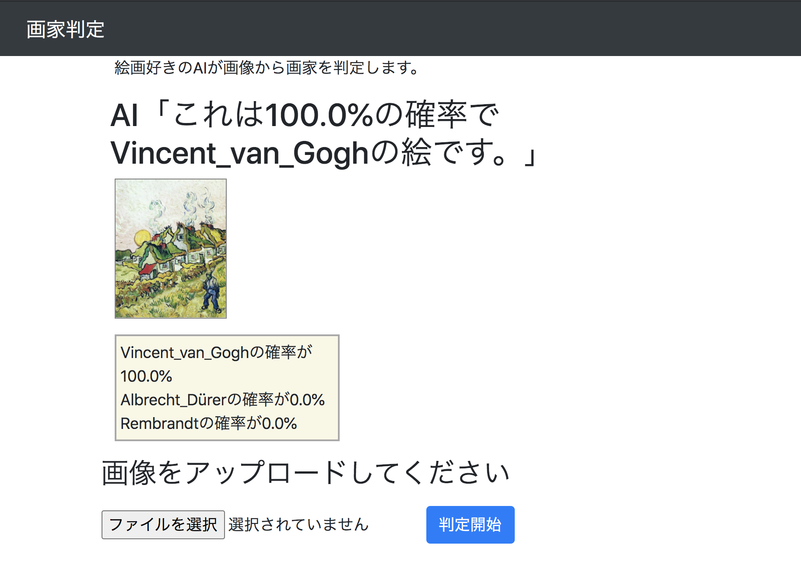

# art-judge

The repository for the art_judge. The web application determine the artist of the image you have uploaded.



# Usage

```
python web.py
```

Access to `localhost:5000` on your browser

# Training

## Create .npy

Convert JPG image to RBG values on each pixels

```
python npy_generate.py
```

You can get `./npy/artists.npy`

## Train your model by CNN

Load .npy file and teach it to a CNN model

```
train_cnn.py
```

You will get `./model/artist-model_{num_artist}_{epochs}.hdf5` and `./model/cnn_model.json",`

# Prediction

In the `web.py` and `judge_artist_name.py`,

- Convert a image you uploaded to RBG values on each pixels
- Load `./model/cnn_model.json` and `./model/artist-model_{num_artist}_{epochs}.hdf5` which is the CNN model of you trained in the previoud step.
- Input your image to the model and predict it.

## CONTRIBUTING

### Install pre-commit

Run the below commands to install `pre-commit`:

```
➜  brew install pre-commit
➜  cd /path/to/art_judge
➜  pre-commit install -f # -f option overwrites .git/hook/pre-commit
```
